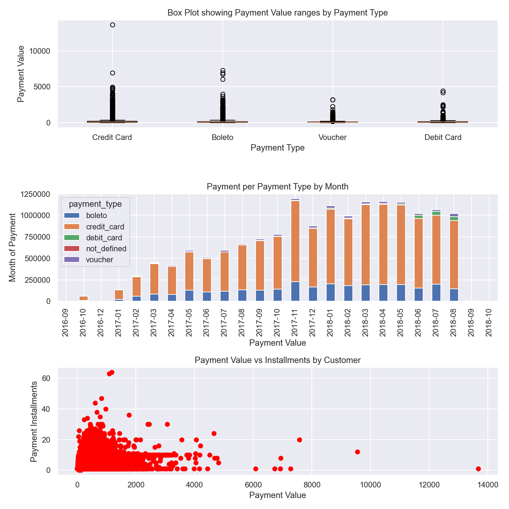

# 📦 Ecommerce Orders Data Analysis – Olist (Brazil)

A Python data analysis project exploring customer orders and payments for Olist, a Brazilian e-commerce platform. This project answers key business questions through data cleaning, merging, and insightful visualizations.

## 📁 Project Overview
**Client:** Olist, a Brazilian online retail marketplace

**Objective:** Analyze customer order and payment data to answer key business concerns around payment types and customer behavior—especially regarding credit card usage.

## 🧾 Key Business Questions
1. Are credit card customers spending more?

2. What is the range of payment values by payment type?

3. How does payment value vary by month and payment type?

4. What is the total monthly payment volume over time?

## 🗂️ Datasets Used
* orders.xlsx: Contains order-level details including status and timestamp

* order_payment.xlsx: Payment-level data including type, value, and installments

* customers.xlsx: Customer profile and location data

## 🔧 Tools & Libraries
* Python

* Pandas for data manipulation

* Matplotlib and Seaborn for visualizations

* Spyder / .py Script

## 🔍 Process Breakdown
1. 📥 Data Loading & Inspection
    * Loaded and inspected three datasets for completeness and structure

    * Identified missing values and potential issues

2. 🧹 Data Cleaning
    * Handled missing values: filled or dropped where appropriate

    * Removed duplicate rows

    * Filtered specific subsets (e.g., high-value credit card transactions, SP state customers)

3. 🔗 Merging Data
    * Joined datasets using order_id and customer_id to create a unified analysis-ready DataFrame

4. 📊 Visualizations & Insights
    * Box Plot: Payment value range by payment type (Credit Card, Boleto, Debit Card, Voucher)

    * Stacked Bar Chart: Monthly payment value by payment type

    * Scatter Plot: Payment value vs. installment count (customer-level)

  

## 📈 Key Insights
* Credit card transactions show a wider and generally higher payment value range compared to other types.

* Monthly payment values peak in certain months, indicating seasonal shopping trends.

* Customers in São Paulo (SP) state are a significant portion of high-value credit card users.

* Some customers tend to use multiple installments even for relatively low amounts.

## 🚀 How to Run
1. Clone the repository

2. Place the datasets (orders.xlsx, order_payment.xlsx, customers.xlsx) in the root directory

3. Run EcommerceOrderProject.py in a Python environment with the required libraries installed

## 📚 Future Improvements
* Add summary tables and dashboards (e.g., via Power BI or Streamlit)

* Incorporate more granular time-series analysis

* Automate reporting with scheduling tools

## 📬 Contact
If you have any questions or suggestions, feel free to reach out via [LinkedIn](www.linkedin.com/in/keegan-murphy-3a3b99218) or check out my [Portfolio](https://keegan-murphy-portfolio.notion.site/Keegan-Murphy-Portfolio-191c89a2d2f380f4a3e7f98aeb368139).
